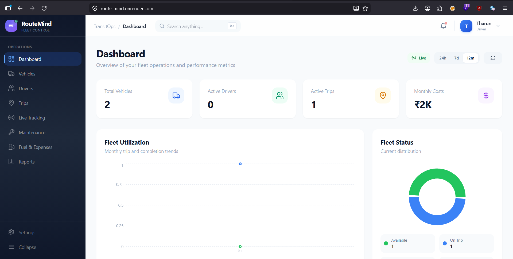
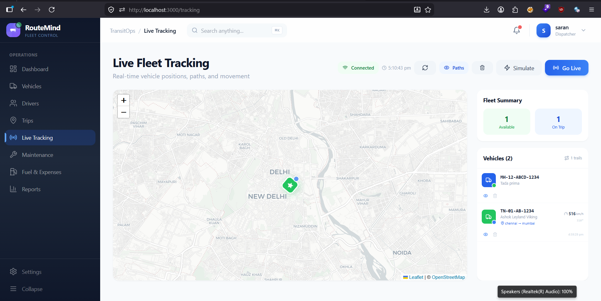
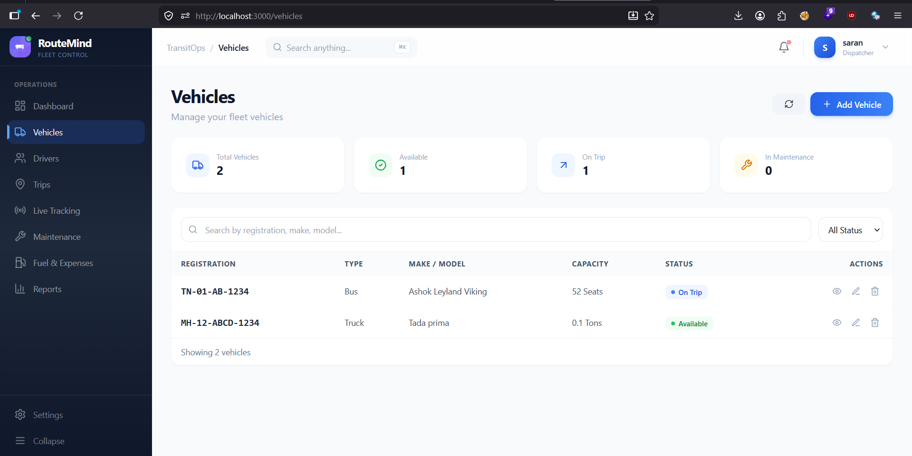
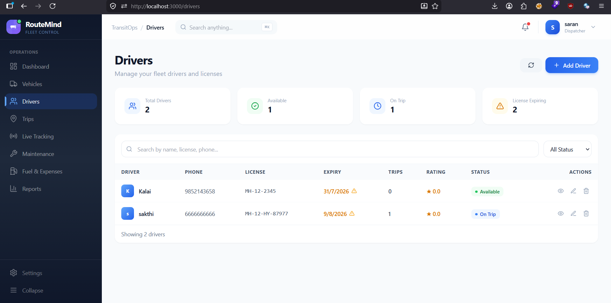

# 🚚 RouteMind


<p align="center">
  <strong>Smart Transport Operations Platform</strong><br>
  A MERN Stack application for efficient fleet, driver, and transport operations management.
</p>

<p align="center">
  
  
  
  
  
</p>

---

## 📖 Overview

RouteMind is a Smart Transport Operations Platform built using the **MERN Stack** to simplify logistics and fleet management. It enables organizations to manage vehicles, drivers, trips, maintenance, fuel expenses, and monitor vehicles in real time through an intuitive dashboard.

---

## ✨ Features

- 🔐 JWT Authentication & Role-Based Access Control
- 📊 Interactive Dashboard
- 🚛 Vehicle Management
- 👨‍✈️ Driver Management
- 🗺️ Trip & Dispatch Management
- 📍 Live Vehicle Tracking (Socket.IO + React Leaflet)
- 🔧 Maintenance Management
- ⛽ Fuel & Expense Tracking
- 📈 Reports & Analytics
- 📄 CSV Export

---

## 📸 Screenshots

### Dashboard



### Live Tracking



### Vehicle Management



### Driver Management



---

## 🛠 Tech Stack

### Frontend

- React (Vite)
- Tailwind CSS
- React Router
- Axios
- React Hook Form
- Recharts
- React Leaflet
- Socket.IO Client

### Backend

- Node.js
- Express.js
- MongoDB
- Mongoose
- JWT
- bcrypt
- Socket.IO

---

## 📂 Project Structure

```text
RouteMind/
│
├── client/
│   ├── src/
│   ├── public/
│   └── package.json
│
├── server/
│   ├── controllers/
│   ├── models/
│   ├── routes/
│   ├── middleware/
│   ├── sockets/
│   ├── config/
│   └── package.json
│
├── assets/
├── README.md
└── .gitignore
```

---

## 🚀 Installation

Clone the repository

```bash
git clone https://github.com/your-username/RouteMind.git
cd RouteMind
```

### Backend

```bash
cd server
npm install
npm run dev
```

### Frontend

```bash
cd client
npm install
npm run dev
```

---

## 🔑 Environment Variables

### `server/.env`

```env
PORT=5000
MONGO_URI=your_mongodb_connection
JWT_SECRET=your_secret_key
CLIENT_URL=http://localhost:5173
```

### `client/.env`

```env
VITE_API_URL=http://localhost:5000/api
VITE_SOCKET_URL=http://localhost:5000
```

---

## 📍 Live Tracking

RouteMind uses **Socket.IO** to simulate GPS tracking. During an active trip, vehicle locations are streamed in real time and displayed on an interactive **OpenStreetMap** using **React Leaflet**.

**Workflow**

```
Dispatch Trip
      │
      ▼
Start Location Simulation
      │
      ▼
Socket.IO emits coordinates
      │
      ▼
Map updates in real time
      │
      ▼
Trip Completed
      │
      ▼
Tracking Stops
```

---

## 📌 Business Rules

- Vehicle registration number must be unique.
- Vehicles under maintenance cannot be dispatched.
- Retired vehicles cannot be dispatched.
- Drivers with expired licenses cannot be dispatched.
- Suspended drivers cannot be dispatched.
- Drivers already assigned to an active trip cannot be reassigned.
- Vehicles already assigned to an active trip cannot be reassigned.
- Cargo weight cannot exceed vehicle capacity.
- Vehicle and driver statuses update automatically throughout the trip lifecycle.

---

## 📊 Future Enhancements

- GPS Device Integration
- Route Optimization
- Geofencing
- Driver Performance Analytics
- Email & SMS Notifications
- Predictive Maintenance
- AI-Based Fleet Analytics

---

## 👨‍💻 Developed For

Hackathon Project

**RouteMind – Smart Transport Operations Platform**

---

## 📄 License

This project is licensed under the **MIT License**.
